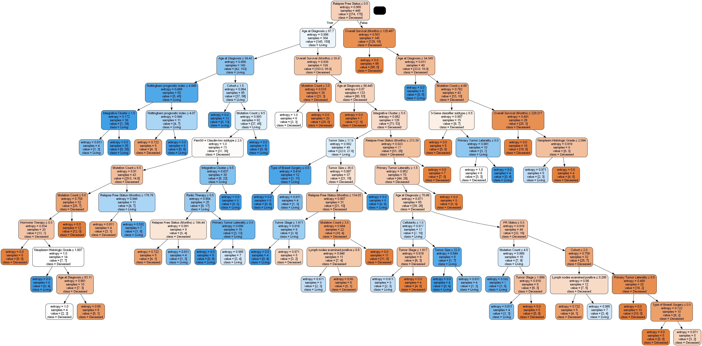
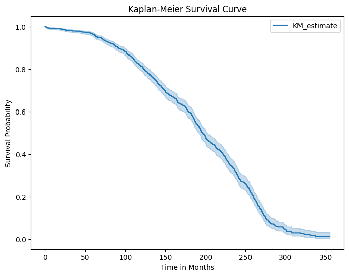

# 🩺 Breast Cancer Survival Prediction

This repository contains a Data Science Capstone Project focused on predicting the survival status (Living or Deceased) of breast cancer patients using machine learning techniques. The project includes data preprocessing, feature engineering, model training and tuning, and performance evaluation.

---

## 📌 Project Objective

To build a predictive model that determines whether a breast cancer patient is likely to survive, based on clinical and genetic information.

---

## 📊 Visualizations

### 🔹 Distribution Tree


### 🔹 Survival Status Distribution



---

## 📊 Dataset Overview

The dataset contains the following:
- Patient demographics
- Tumor characteristics
- Treatment types
- Genetic markers
- Survival status (Target variable: `0` = Deceased, `1` = Living)

---

## ⚙️ Technologies Used

- **Python**
- **Pandas**, **NumPy** – Data manipulation
- **Matplotlib**, **Seaborn** – Visualization
- **Scikit-learn** – ML modeling and evaluation
- **Support Vector Machine (SVM)** – Model training
- **GridSearchCV** – Hyperparameter tuning

---

## 🔍 Project Workflow

### 1. Data Preprocessing
- Handled missing values
- Label encoded categorical features
- Scaled numerical features
- Removed outliers

### 2. Exploratory Data Analysis (EDA)
- Distribution plots, correlation heatmaps
- Visual analysis of survival patterns

### 3. Model Building
- Trained multiple models, with **SVM** selected as best based on recall performance
- Hyperparameter tuning using **GridSearchCV**

---

## 📈 Results

- **Model Used:** Support Vector Machine (SVM)
- **Evaluation Metric Focus:** Recall
  - **Recall for Living patients (Class 1):** 0.79
  - **Recall for Deceased patients (Class 0):** 0.85

---

## ✅ Inference

In this project on **Breast Cancer Survival Prediction**, the **SVM model** emerged as the most effective for predicting patient survival. The focus on **recall for Living patients (class 1)** was crucial, as the primary objective in a medical context is to ensure that all **surviving patients** are accurately identified to provide them with the necessary care and treatment.

While **false positives** (deceased patients misclassified as living) are important to minimize, **false negatives** (living patients misclassified as deceased) in cancer survival prediction can have severe consequences, such as **denying life-saving treatments**. Thus, high recall for class 1 ensures that **no living patients are overlooked** and receive the appropriate medical intervention.

The **SVM model** was chosen due to its ability to establish an **optimal decision boundary**, which is crucial for distinguishing between **living** and **deceased** patients with minimal misclassification. Its performance in terms of recall for **Living patients** at **0.79** and **Deceased patients** at **0.85** shows that it effectively balances identifying patients in both classes, making it the most reliable model for this application.

For a **Breast Cancer Survival Prediction** project, where patient lives are at stake, **SVM** is the ideal model due to its **strong recall performance for class 1 (Living)**. By ensuring accurate predictions for **surviving patients**, we enhance the likelihood that all those in need of care will receive the necessary treatment, thereby improving overall patient outcomes and safety.

---

## 📁 Project Structure


---

## 📌 Future Work

- Incorporate more advanced models (e.g., XGBoost, Neural Networks)
- Use SHAP for model explainability
- Build a Streamlit web app for interactive predictions

---

## 📌 How to Run
Clone the repository:
   ```bash
   git clone https://github.com/Mallikarjun-B-Patil/Breast-Cancer-Survival-Prediction.git
   ```
---

## 🙋‍♂️ Author

Mallikarjun  
[LinkedIn](https://www.linkedin.com/in/mallikarjunpatil4472) | [GitHub]([https://github.com/](https://github.com/Mallikarjun-B-Patil))


